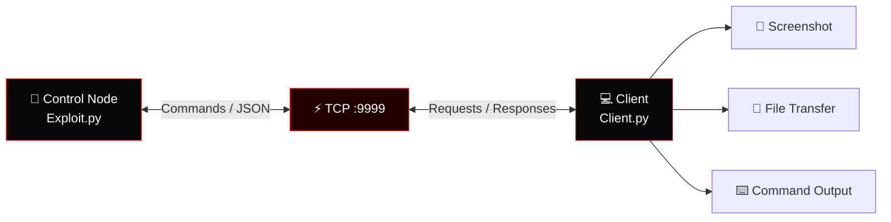
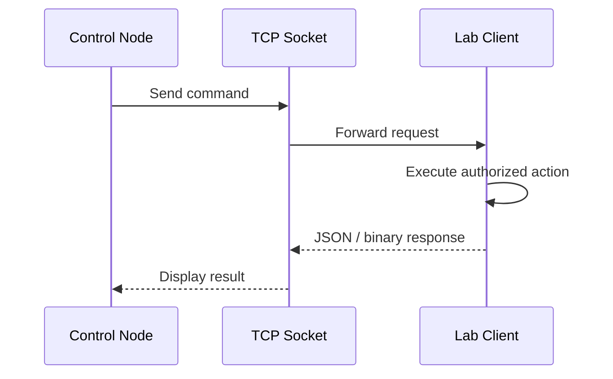
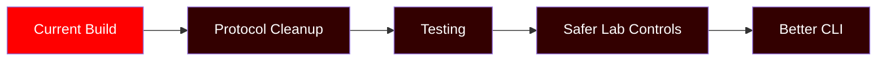

<div align="center">

# 🔴 REVERSE SHELL v2

### TCP • COMMANDS • FILES • SCREENSHOTS


<br>


<a href="https://github.com/romilleuva/reverse-shell-v2">

</a>
<a href="https://github.com/romilleuva/reverse-shell-v2">

</a>

<br><br>


</div>

---

## ⚡ Overview

A Python client/server project for learning:

- TCP socket communication
- JSON messaging
- Command execution
- Screenshot transfer
- File upload and download

> 🔴 Use only on systems you own or are explicitly authorized to test.

---

## 🧬 Architecture



---

## 🔴 Modules

| Module | Status |
|---|---|
| TCP communication | 🔴 Online |
| Remote commands | 🔴 Online |
| Screenshot capture | 🔴 Online |
| File upload/download | 🔴 Online |
| JSON protocol | 🔴 Online |
| Interactive CLI | 🔴 Online |

---

## 🚀 Quick Start

```bash
git clone [https://github.com/romilleuva/reverse-shell-v2.git](https://github.com/romilleuva/reverse-shell-v2.git)
cd reverse-shell-v2
pip install pyautogui
```

### Control node

```bash
python Exploit.py
```

### Authorized lab client

```bash
python Client.py
```

Default connection:

```text
127.0.0.1:9999
```

---

## 🖥️ Demo Flow



---

## 🛡️ Safety

✅ Personal machines  
✅ Isolated virtual labs  
✅ CTF environments  
✅ Authorized penetration tests  

❌ Unauthorized systems  
❌ Credential theft  
❌ Data theft  
❌ Production systems without permission  

---

## 🧰 Project Structure

```text
reverse-shell-v2/
├── Client.py
├── Exploit.py
├── README.md
└── assets/
```

---

## 🗺️ Roadmap



---

<div align="center">

### 👤 ROMIL LEUVA


<br>

⭐ Star the repository if it helped you learn.


</div>
